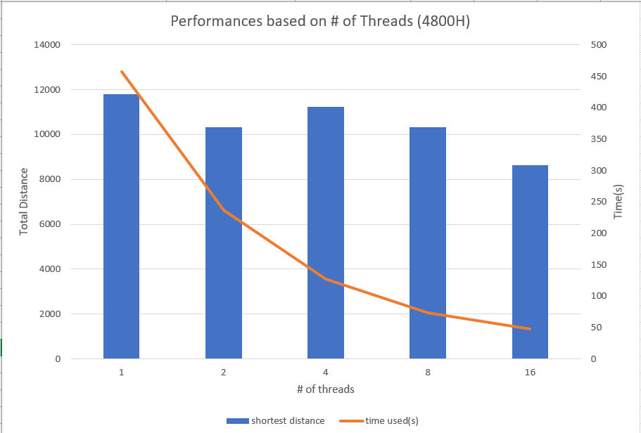
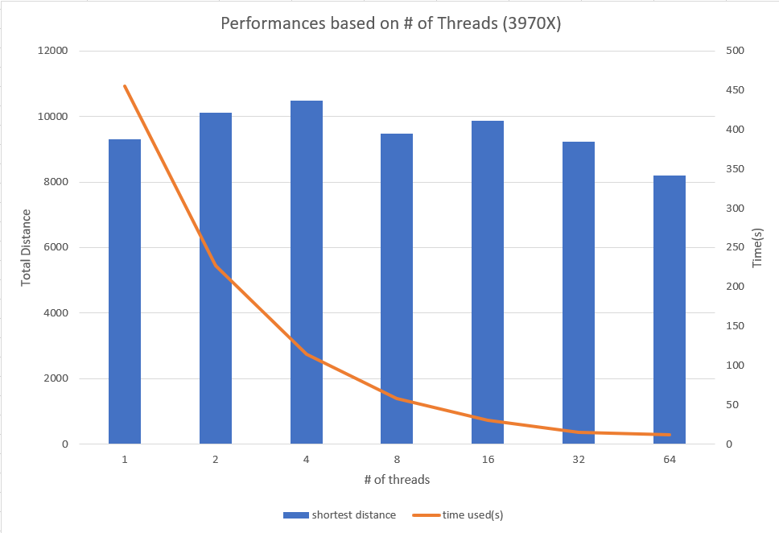

<h2>

 
TSP project - Part 4 (Multithreading)

 
</h2>

    Eriksen Liu

### How to implement & Result

I choose the parameters as <code>num_iter = 4000000, pop_size = 1000, mut_rate = 0.3</code> to test the performance of the code for this entire project.  
In order to test the codes, we can use Makefile to make tsp program by typing the following commands in the console:

    make
    time ./tsp filename.tsv pop_size mut_rate n_thread

Or we can see the following commands as well if Makefile doesn't work,

    g++ -Wall -Wextra -pedantic -Werror -std=c++17 -O3 -pthread cities.cc chromosome.cc climb_chromosome.cc deme.cc tournament_deme.cc tsp.cc -o tsp
    time ./tsp filename.tsv pop_size mut_rate n_thread

### Result

With the implementation above, I tested the program with my home machine with AMD Ryzen 7 4800H (8-core, 16-thread) and patty virtual machine with AMD Ryzen Threadripper 3970X (32-cores, 64-thread).  
For 4800H, I collected the data as below,

| # of threads | Shortest Distance | Time (s) |
| :----------- | :---------------: | :------: |
| 1            |      11799.8      | 457.808  |
| 2            |       10329       | 236.327  |
| 4            |      11249.1      | 126.915  |
| 8            |       10315       |  73.327  |
| 16           |      8647.19      |  47.518  |

With the diagram like the following,

The plotted diagram show that the shortest distance doesn't change based on the numbers of the threads. However, the time used to compute shortest distance decreased over the number of threads. The general trend can be expressed as <code>time = (time used for 1 thread)/(the number of threads using now)</code>. The codes in <code>tsp.cc</code> were built to split one of the threads to compute <code>num_iter / nthreads</code>. So the general trend matches the intention of the codes.

For 3970X, I collected the data as below,

| # of threads | Shortest Distance | Time (s) |
| :----------- | :---------------: | :------: |
| 1            |      9290.08      | 454.758  |
| 2            |      10104.6      | 227.281  |
| 4            |      10467.3      |  114.21  |
| 8            |      9464.61      |  58.542  |
| 16           |      9861.46      |  30.317  |
| 32           |      9226.41      |  15.542  |
| 64           |      8190.83      |  12.046  |

With the diagram like the following,

Since my home computer can't handle 16 threads well, so the time used is a little bit off from the general trend. But while using 3970X, the data matches perfectly. We can see that the best performance point in the graph above as 12.046s is 37.75x faster than the single-threaded performance as 454.758s. 
The best performance I got is 7098.91 with the ordering presented in <code>best</code>.tsv.